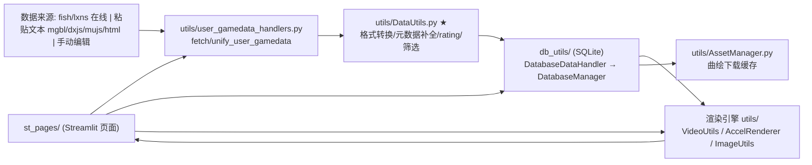

# 项目记忆（mai-gen-videob50）

> 本文件为项目级 Agent 记忆。需要对项目进行深入开发时，Agent 应先阅读本文件了解项目架构、数据流、关键模块与函数，从而节约遍历整个项目的 token。

需要对mai-gen-videob50项目进行深入开发时，要求Agent阅读本文档以了解项目架构、数据流、关键模块与函数，从而节约遍历整个项目的token。

## 项目概述

基于 **Streamlit** 的舞萌/中二节奏（maimai / CHUNITHM）"B50 成绩单"生成器：从第三方查分器（水鱼 fish、落雪 lxns）或用户粘贴文本（mgbl/dxjs/mujs/HTML）获取玩家成绩，经统一转换后存入 **SQLite**，再生成 50 张成绩图片并合成为带转场的完整视频。数据格式的"唯一权威"在 `utils/DataUtils.py`，存储层在 `db_utils/`，渲染层在 `utils/`。

> `b50/` 是本地开发用的 Python venv，已被 `.gitignore` 忽略，**不要提交**；真正的源码在根目录与 `st_pages/`、`utils/`、`db_utils/`、`scripts/`。

## 快速启动

```bash
# 1. 创建/使用 venv（项目内已有名为 b50/ 的虚拟环境，被 git 忽略）
python -m venv b50
# 2. 安装依赖
b50\Scripts\pip install -r requirements.txt
# 3.（可选）GPU 加速渲染需要额外装 taichi 与 ffmpeg.exe/ffprobe.exe（放运行目录）
b50\Scripts\pip install taichi
# 4. 运行
b50\Scripts\streamlit run st_app.py
```

依赖要点：`streamlit`、`moviepy`、`requests`、`bilibili-api-python`、`pytubefix`、`lxml`、`opencv-python`、`Pillow`、`pyyaml`。数据库文件默认 `mai_gen_videob50.db`（相对项目根）。

## 项目架构图（含数据链条）



## 核心模块

- **`st_pages/`**：10 个 Streamlit 页面（首页/获取数据/生成图片/编辑/合成视频等），只做 UI 与参数编排，业务逻辑下沉到 utils。
- **`db_utils/DatabaseManager.py`**：SQLite 建表/迁移/各表 CRUD；**`DatabaseDataHandler.py`**：对上层的数据业务封装（建存档、智能同步记录、格式化读取）。
- **`utils/DataUtils.py` ★（最核心）**：数据格式唯一权威——rating 计算、chart/level 映射、曲库元数据查询、`fish/lxns_to_new_record_format`、`*_to_unified`、`filter_unified_b50`。改数据逻辑先看这里。
- **`utils/user_gamedata_handlers.py`**：在线抓取（fish/lxns）与本地文本统一入口，产出"存档初始化 dict"。
- **`utils/VideoUtils.py` / `AccelRenderer.py`**：视频合成（MoviePy CPU 路径 / Taichi+FFmpeg GPU 路径），API 兼容可切换。
- **`utils/AssetManager.py`**：曲绘下载与本地缓存、自定义曲绘优先。
- **`utils/PageUtils.py`**：全局配置读写、路径、主题等公共工具（被多方引用）。
- **`scripts/`、`external_scripts/`**：离线批量脚本与 JS（ffmpeg 拼接、成绩注入、PO Token）。

## 关键 API / 函数速查

| 层 | 函数 | 作用 |
|---|---|---|
| 入口 | `Setup_Achievements.handle_new_data(username, source, params)` | 数据入库 UI 入口 |
| 组F | `fetch_user_gamedata` / `unify_user_gamedata(raw_file_path, username, params, source)` | 在线抓取 / 文本统一 |
| 组D | `fish_to_new_record_format` / `lxns_to_new_record_format(record, game_type)` | 第三方→DB 记录 |
| 组D | `filter_unified_b50(unified_data, filter, game_type)` | B50 筛选/排序 |
| 组D | `compute_rating(ds, score)` / `compute_chunithm_rating(ds, score)` | 单曲 Rating |
| 组C | `get_database_handler()` | 取 DB 单例 |
| 组C | `create_new_archive(...)` / `update_archive_records(username, records, archive_name)` | 建档/入库 |
| 组C | `load_archive_for_image_generation(archive_id)` / `load_full_config_for_composite_video(...)` / `load_video_configs(...)` | 图片/视频读取 |
| 组E | `render_all_video_clips(...)` / `render_complete_full_video(...)` | 渲染视频 |

## 环境变量 / 关键配置

- **`global_config.yaml`**（运行时配置，`PageUtils.read_global_config` 读取）：`USE_GPU_ACCEL`（是否 GPU 渲染）、`DOWNLOADER`（bilibili/youtube）、`YOUTUBE_API_KEY`、`HTTP_PROXY`/`PROXY_ADDRESS`、`VIDEO_RES`/`VIDEO_BITRATE`、`VIDEO_TRANS_ENABLE`/`VIDEO_TRANS_TIME`、`CLIP_PLAY_TIME`、`FULL_LAST_CLIP` 等。
- **`utils/DataUtils.py` 常量**：`BUCKET_ENDPOINT`（阿里云 OSS，曲库元数据源）、`FC_PROXY_ENDPOINT`（函数计算代理，查分器 API）、`LXNS_API_ENDPOINT`（曲绘 CDN）、`DEFAULT_B15_VERSION`（标记B15版本名，每年1/3/7/9月可能需要更新）。
- **本地凭证**：落雪 API key 存于 `{user_base_dir}/lxns_credentials.json`（不入库）。
- 系统依赖：`ffmpeg`/`ffprobe`（≥5.0，GPU 路径必需），可选 `node`（ffmpeg-concat 拼接）。

## 常见开发任务

- **新增一个数据源**：① 在 `DataUtils.py` 写 `xxx_to_unified()`；② 在 `user_gamedata_handlers.unify_user_gamedata()` 加 `source` 分支；③ 在 `Setup_Achievements.py` 的导入 UI 中注册入口与 params。
- **修改数据库模型（加表/字段）**：① 改 `db_utils/schema.sql`；② 在 `db_utils/migrations/` 加 `NNN_xxx.sql`（头注释 `Version: x.y`）；③ 在 `DatabaseManager` 加对应 CRUD 方法；④ 在 `DatabaseDataHandler` 封装业务方法。
- **改动曲绘/元数据逻辑**：改 `utils/AssetManager.py` 与 `DataUtils.py` 的元数据查询（注意 `load_metadata` 有 `lru_cache`）。
- **调整视频样式/渲染**：改 `static/video_style_config.json`（`style_config` 的 `asset_paths`、`content_text_style` 等）与 `VideoUtils.py`/`AccelRenderer.py` 的相对位置常量。
- **添加 Streamlit 页面**：在 `st_pages/` 新建 `.py`，用 `st.switch_page("st_pages/xxx.py")` 跳转。
- **新增在线 API 调用**：遵循 `user_gamedata_handlers` 模式——HTTP 获取 → 缓存原始 JSON → `generate_archive_data` 转换。

## 约定与注意

- 所有数据入库/读取都经 `get_database_handler()` 单例，避免直接连库。
- `DataUtils.py` 中大量 `TODO: 替换为 hash id`、`@DeprecationWarning`（MTBL/song_id 编码系列）为已知待清理项；新代码需沿用旧 song_id 方案，但需同样留下TODO以备后续修改。
- 修改 `DataUtils` 的字段映射会波及 DB 与页面，改动前先全局搜索调用方。
